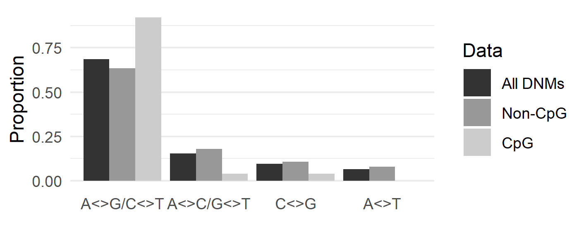

# Allele spectrum similarities as a signal of common descent

## Background
This analysis was made in preparation of a contribution to a book on evolutionary creation (theistic evolution) vs anti-evolutionary creation ("creationism"). A similar analysis was made by  [Steve Schaffner](https://biologos.org/articles/testing-common-ancestry-its-all-about-the-mutations) in 2017 and then replicated by [EvoGrad](https://evograd.wordpress.com/2019/02/20/human-genetics-confirms-mutations-as-the-drivers-of-diversity-and-evolution/) in 2019. I replicate these analyses here and add some additional data sets as well.

When evaluating the genetic evidence for or against common descent, genetic similarities such as ERV/LTR can be a useful tool. Howeber, genetic *differences* between organisms may also provide us with data to assess the theory of common descent.

Genetic differences can arise through different means, one of the being point mutations when one base is substituted for another. Twelve substitutions are possible: A>C, A>G, A>T, C>A, C>T, C>G, etc. As explained by [Schaffner](https://biologos.org/articles/testing-common-ancestry-its-all-about-the-mutations), not all substitutions be distinguished from each other since we do not always know which is the ancestral allele or which of the two complementary strands that were actually changed. We can instead group the substitutions in four classes. The substitutions in the first class are called transitions and the other three classes are called transversions.

1. A<>G, C<>T
1. A<>C, G<>T
1. C<>G
1. A<>T

Transitions are more frequent than transversions. This is due to a similar chemical structure between A and G (they are called [purines](https://en.wikipedia.org/wiki/Purine)), and likewise C and T are chemically similar (called [pyrimidines](https://en.wikipedia.org/wiki/Pyrimidine)). The consequence is that when a substitution occurs during DNA replication, a purine tends to be substituted by a purine and a pyrimidine tends to be substituted by a pyrimidine. In other words, class 1 (transitions) will be more common than the other classes (transversions). If a genetic difference between two indivduals (or species) is due to mutations, we expect to find a pattern of relatively high A/G and C/T diversity.

# Analyses
## 1. De novo mutations
One possible way to investigated mutation frequency patterns is by sequencing children and parents and identify de novo mutations (DNMs). Smith et al (2018) compiled data from three studies which included more than 130,000 autosomal DNMs. I extracted the mutation classes from this data. When C is followed by G (called CpG island), it is more likely to be converted into a T. In other words, C>T transitions in CpG islands will be more common than in non-CpG areas. Since CpG constitute only a minor part of the genome, the overall pattern is the same whether we include them or not: transitions constitute ~65% of all de novo mutations. In the following analyses all DNMs are included.

<figure>
  
  <figcaption>***Fig. 1.** Excluding CpG islands has a minor effect on the allele frequence spectrum.*</figcaption>
</figure>

## 2. Human genetic diversity
An alternative method is to look at the genetic diversity in in the human population. This was done in the 1000 genomes project (2015). The data is publicly available and the SNP spectrum can be easily extracted (`1000genomes_data_download.sh`, `1000genomes_extract_groups.sh`). When I did this, the distribution was congruent with the DNM data: A<>G and the C<>T diversity (transitions) are much more common than transversions (fig. 1, medium bars). Once again, this is expected if the diversity is due to mutations.

## 3. Great ape diversity
Finally, we can compare the DNA diversity between different species, eg the great apes. We can do this by collecting and sequencing DNA from different individuals of a species and select the sites that have a fixed allele (all individuals are identical) but that are different to the other species. The genetic differences will be much bigger than within one species, but the same basic principle still applies: If the differences are due to point mutations we expect a characteristic pattern with respect to the kind of differences between the species. On the other hand, if the differences are not due to point mutations there is no reason to expect a specific pattern.

We can analyze the allele frequency spectrum using publically available data. Prado-Martinez (2013) collected and sequenced DNA from 79 great apes representing 5 species (Gorilla, Pan troglodytes, Pan paniscus, Pongo abelii, Pongo pygmaeus) and 9 humans. They identified the sites that are different from the human reference genome. In some cases, individuals within a species will be similar (allele is fixed), in other cases there will be genetic variation within a species (allele is polymorphic). For the 25 Pan troglodytes (chimpanzee) specimens, they identified 25 million fixed sites (script: `chimp_count_fixed.sh`). As before, we can separate the genetic differences in four classes (script: `primates_extract_groups_fixed.sh`, `primates_extract_groups_fixed_helper.sh`). This reveals that A<>G and C<>T diversity is much higher than the other types (file: `outdata/primates_groups.Pan_troglodytes_fixed.tsv`), which is expected if it is a result of transitions.

In fact, if we compare the genetic diversity between chimpanzee and humans with human de novo mutations and total human genetic diversity, the patterns are strikingly similar:

similary pattern of the mutation spectrum. REF sequenced the genomes of ... great apes. Filtering on the fixed mutations gives an almost identical resultat to the DNM data and the 1000 genomes data (fig. 1, light bars).

# Results
Det är också exakt vad vi ser. I figur 7 visas att fördelningen av punktmutationer är likadan mellan arterna som inom den mänskliga arten. Detta är en stark indikation på att de genetiska skillnaderna har uppkommit genom samma mekanism.

---
Of course, these spectra don’t match perfectly – nothing in biology is so clear cut. Even different human populations have slightly different mutational spectra. Mutation rates do evolve, after all, and this affects the relative rates of the different types of mutations. In fact, mutation spectra actually get slightly more dissimilar between species as the divergence between them increases. For example, the human and chimp spectra are more similar than the human and gorilla spectra, and the human, chimp, and gorilla spectra are more similar to one another than the human and orangutan, or gorilla and orangutan, spectra are (Harris and Pritchard, 2017). Once again, this familiar nested hierarchy pattern emerges from the data, consistent with the prevailing view of the ancestry of humans within the great apes.

---

## Alternative explanations

# Description of files
`DNM_extract_groups.sh` Extraction of DNM 

# References
Prado-Martinez, Javier, Peter H. Sudmant, Jeffrey M. Kidd, Heng Li, Joanna L. Kelley, Belen Lorente-Galdos, Krishna R. Veeramah, et al. 2013. “Great Ape Genetic Diversity and Population History.” Nature 499 (7459): 471–75. [*Link*](https://www.ncbi.nlm.nih.gov/pmc/articles/PMC3822165), [*Data*](https://eichlerlab.gs.washington.edu/greatape/data/VCFs/SNPs).

Smith, Thomas C. A., Peter F. Arndt, and Adam Eyre-Walker. 2018. “Large Scale Variation in the Rate of Germ-Line de Novo Mutation, Base Composition, Divergence and Diversity in Humans.” PLoS Genetics 14 (3): e1007254. [*Link*](https://journals.plos.org/plosgenetics/article?id=10.1371/journal.pgen.1007254), [*Data*](https://datadryad.org/stash/landing/show?big=showme&id=doi%3A10.5061%2Fdryad.935vc).

1000 Genomes Project Consortium, Adam Auton, Lisa D. Brooks, Richard M. Durbin, Erik P. Garrison, Hyun Min Kang, Jan O. Korbel, et al. 2015. “A Global Reference for Human Genetic Variation.” Nature 526 (7571): 68–74. [*Link*](https://www.nature.com/articles/nature15393), [*Data*](ftp://ftp.1000genomes.ebi.ac.uk/vol1/ftp/release/20130502).
