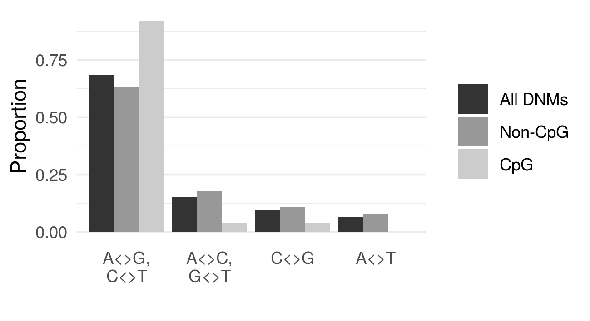

# Allele spectrum similarities as a signal of common descent

## Background
> This analysis was made in preparation of a contribution to a Swedish book on evolutionary creation (theistic evolution) vs anti-evolutionary creation ("creationism"). It was inspired a similar analysis made by  [Steve Schaffner](https://biologos.org/articles/testing-common-ancestry-its-all-about-the-mutations) in 2017 which was replicated by [EvoGrad](https://evograd.wordpress.com/2019/02/20/human-genetics-confirms-mutations-as-the-drivers-of-diversity-and-evolution/) in 2019.

When evaluating the genetic evidence for or against common descent, genetic similarities such as endogenous retroviruses (ERVs). Howeber, genetic *differences* between organisms may also provide us with data to assess the theory of common descent. Genetic differences can arise through different means, one of them being point mutations when one base is substituted for another. There are four bases: A, C, G and T, meaning that twelve substitutions are possible: A>C, A>G, A>T, C>A, C>T, C>G, etc. Unfortunately, it is not always possible to say which base has changed into which. For example, if we have the sequences, one with A and one with T, we don't know if A has changed into T or T has changed into A unless we have the sequence of the common ancestor. In addition, DNA is double stranded so that A is always paired with T and G is always paired with C, so we cannot say from only present data which base was mutated. So instead of grouping the mutations into twelve classes, we can group them in four identifiable classes. Mutations within the first class are called transitions and the other three classes are called transversions.

1. A<>G, C<>T
1. A<>C, G<>T
1. C<>G
1. A<>T

Transitions are more frequent than transversions. This is due to a similar chemical structure between A and G (they are called purines), and likewise C and T are chemically similar (called pyrimidines). The consequence is that when a point mutation occurs during DNA replication, a purine tends to be substituted by a purine and a pyrimidine tends to be substituted by a pyrimidine (figure 1). In other words, class 1 (transitions) will be more common than the other classes (transversions). If a genetic difference between two individuals (or species) is due to mutations, we expect to find a pattern of higher A<>G and C<>T diversity compared to other kinds.

<figure>
  
  <figcaption><i><b>Fig. 1.</b> A and G (purines) and C and T (pyrimidines) respectiviely are similar, so mutations to the same type of base is more common (transitions). Other mutations (transversions) are less common because the bases are more different.</i></figcaption>
</figure>

# Analyses
## 1. De novo mutations
One possible way to investigate mutation frequency patterns is by sequencing children and parents and identify de novo mutations (DNMs). On average, around 60 point mutations arise every generation (the human mutation rate). This kind of data is publically available from several studies, including from Smith et al (2018) who performed a meta-study including more than 130,000 autosomal DNMs. I extracted the mutation classes from this data. When C is followed by G (called CpG island), it is more likely to be converted into a T. In other words, C>T transitions in CpG islands will be more common than in non-CpG areas. Since CpG constitute only a minor part of the genome, the overall pattern is the same whether we include them or not: transitions constitute ~65% of all de novo mutations. In the following analyses all DNMs are included.

<figure>
  
  <figcaption><i><b>Fig. 1.</b> Excluding CpG islands has a small effect on the allele frequence spectrum.</i></figcaption>
</figure>

## 2. Human genetic diversity
An alternative method is to look at the genetic diversity in in the human population. This was done in the 1000 genomes project (2015). The data is publicly available and the SNP spectrum can be easily extracted (`1000genomes_data_download.sh`, `1000genomes_extract_groups.sh`). When I did this, the distribution was congruent with the DNM data: A<>G and the C<>T diversity (transitions) are much more common than transversions (fig. 1, medium bars). Once again, this is expected if the diversity is due to mutations.

## 3. Great ape diversity
Finally, we can compare the DNA diversity between different species, eg the great apes. We can do this by collecting and sequencing DNA from different individuals of a species and select the sites that have a fixed allele (all individuals are identical) but that are different to the other species. The genetic differences will be much bigger than within one species, but the same basic principle still applies: If the differences are due to point mutations we expect a characteristic pattern with respect to the kind of differences between the species. On the other hand, if the differences are not due to point mutations there is no reason to expect a specific pattern.

We can analyze the allele frequency spectrum using publically available data. Prado-Martinez (2013) collected and sequenced DNA from 79 great apes representing 5 species (Gorilla, Pan troglodytes, Pan paniscus, Pongo abelii, Pongo pygmaeus) and 9 humans. They identified the sites that are different from the human reference genome. In some cases, individuals within a species will be similar (allele is fixed), in other cases there will be genetic variation within a species (allele is polymorphic). For the 25 Pan troglodytes (chimpanzee) specimens, they identified 25 million fixed sites (script: `chimp_count_fixed.sh`). As before, we can separate the genetic differences in four classes (script: `primates_extract_groups_fixed.sh`, `primates_extract_groups_fixed_helper.sh`). This reveals that A<>G and C<>T diversity is much higher than the other types (file: `outdata/primates_groups.Pan_troglodytes_fixed.tsv`), which is expected if it is a result of transitions.

# Results
If we compare the genetic diversity between chimpanzees and humans with human de novo mutations and total human genetic diversity, the patterns are strikingly similar (`make_plots.R`). This is true whether we include only fixed alleles (fig. 2) or both fixed and polymorphic alleles (fig. 3).

<figure>
  
  <figcaption><i><b>Fig. 2.</b> Human de novo mutation data, human genetic variation (from 1000 genomes project) and genetic difference between humans and chimpanzees (fixed alleles) show an almost identical spectrum of differences - a strong indication that the diversity has arisen by similar means.</i></figcaption>
</figure>

<figure>
  
  <figcaption><i><b>Fig. 3.</b> Same data as fig. 2, including both fixed and polymorphic alleles in the chimpanzee genome.</i></figcaption>
</figure>

We get bigger differences when we exclude CpG islands from the DNM data, but the general trend is still the same (fig. 4).

<figure>
  
  <figcaption><i><b>Fig. 4.</b> Same data as fig. 2, but excluding CpG islands. The differences are bigger but the general trend is the same.</i></figcaption>
</figure>
  

The three different data sets - human de novo mutations, total human genetic variation, and the genetic diversity between humans and chimpanzees, show highly similar allele frequency spectra. This is a strong indication that the genetic variation has arisen by similar means. If the interspecies diversity instead were a result of de novo creation, there would be no reason to expect this congruence between the data.

<!--

CpG
-->

Finally, we can compare the allele frequency spectrum of the other great apes to the human reference genome. Figure 5 shows only fixed sites and figure 6 shows both fixed and polymorphic sites. The spectra match nicely, indicating that a similar mechanism (point mutations) is responsible for the genetic differences between the species.

<figure>
  
  <figcaption><i><b>Fig. 5.</b> Allele frequency spectrum for the great apes compared two the human reference genome (fixed sites only).</i></figcaption>
</figure>

<figure>
  
  <figcaption><i><b>Fig. 6.</b> Allele frequency spectrum for the great apes compared two the human reference genome (fixed and polymorphic sites).</i></figcaption>
</figure>
  

Figures 5 and 6 also shows another interesting thing that was pointed out in the Evograd post: There is a slight difference between the species: the human mutation spectrum is most similar the chimpanzee one, then to bonobo, then to gorilla and orangutan. There is a natural explanation for this: Different species, and even different populations within the same species, often have slightly different allelele frequency spectra. Harris and Pritchard (2017) report that almost every great ape species and human continental group has its own distinctive mutation spectrum. Combine these results with what we see in figures 5 and 6 and the conclusion is all but inevitable: Evolutionary closely related species have a more similar spectrum, while more divergent species have a more dissimilar spectrum. Harris and Pritchard (2017) make a model (fig. 5B) of the evolution of the allele frequency spectrum based on the Prado-Martinez et al. (2013) data, adding to the explanatory power of the common descent hypothesis.

# Conclusions
We have compared three categories of genetic variation: 1) Human de novo mutations, i.e. the genetic diversity that arises in every new generation; 2) the naturally occurring variation in the human genome; and 3) the types of single nucleotide variations that separate the human and chimpanzee genome. The allele frequency spectra that describe these three categories are highly similar, indicating that a common mechanism is responsible in all three cases. Since we know that human de novo genetic variation is the result of point mutations, the most reasonable conclusion is that point mutations are also responsible for the genetic differences between the great ape species. The theory of creation through common descent thus has a high explanatory power - certainly much higher than the alternative hypothesis that the genomes were individually created. 

# References
Harris, Kelley, and Jonathan K. Pritchard. 2017. “Rapid Evolution of the Human Mutation Spectrum.” eLife 6 (April). [*Link*](https://doi.org/10.7554/eLife.24284).

Prado-Martinez, Javier, Peter H. Sudmant, Jeffrey M. Kidd, Heng Li, Joanna L. Kelley, Belen Lorente-Galdos, Krishna R. Veeramah, et al. 2013. “Great Ape Genetic Diversity and Population History.” Nature 499 (7459): 471–75. [*Link*](https://www.ncbi.nlm.nih.gov/pmc/articles/PMC3822165), [*Data*](https://eichlerlab.gs.washington.edu/greatape/data/VCFs/SNPs).

Smith, Thomas C. A., Peter F. Arndt, and Adam Eyre-Walker. 2018. “Large Scale Variation in the Rate of Germ-Line de Novo Mutation, Base Composition, Divergence and Diversity in Humans.” PLoS Genetics 14 (3): e1007254. [*Link*](https://journals.plos.org/plosgenetics/article?id=10.1371/journal.pgen.1007254), [*Data*](https://datadryad.org/stash/landing/show?big=showme&id=doi%3A10.5061%2Fdryad.935vc).

1000 Genomes Project Consortium, Adam Auton, Lisa D. Brooks, Richard M. Durbin, Erik P. Garrison, Hyun Min Kang, Jan O. Korbel, et al. 2015. “A Global Reference for Human Genetic Variation.” Nature 526 (7571): 68–74. [*Link*](https://www.nature.com/articles/nature15393), [*Data*](ftp://ftp.1000genomes.ebi.ac.uk/vol1/ftp/release/20130502).
